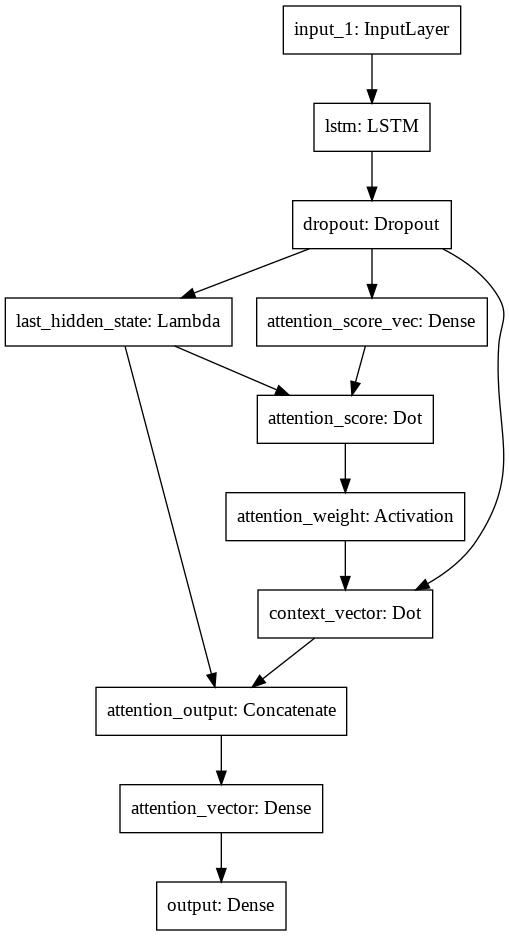

# keras attention text generator

## Installation

Local : 
``` bash 
git clone https://github.com/ytype/keras-attention-text-generator.git
cd keras-attention-text-generator
pip install -r requirements.txt
```

Colab :

```
!pip install keract
!git clone https://github.com/ytype/keras-attention-text-generator.git
cd /content/keras-attention-text-generator
```

## Usage

``` bash
python main.py --epoch 1000 --batch_size 64 --file example/file.txt
```

## Model

keras attention code from [here](https://github.com/philipperemy/keras-attention-mechanism)



```
__________________________________________________________________________________________________
Layer (type)                    Output Shape         Param #     Connected to                     
==================================================================================================
input_1 (InputLayer)            [(None, 100, 1)]     0                                            
__________________________________________________________________________________________________
lstm (LSTM)                     (None, 100, 32)      4352        input_1[0][0]                    
__________________________________________________________________________________________________
dropout (Dropout)               (None, 100, 32)      0           lstm[0][0]                       
__________________________________________________________________________________________________
attention_score_vec (Dense)     (None, 100, 32)      1024        dropout[0][0]                    
__________________________________________________________________________________________________
last_hidden_state (Lambda)      (None, 32)           0           dropout[0][0]                    
__________________________________________________________________________________________________
attention_score (Dot)           (None, 100)          0           attention_score_vec[0][0]        
                                                                 last_hidden_state[0][0]          
__________________________________________________________________________________________________
attention_weight (Activation)   (None, 100)          0           attention_score[0][0]            
__________________________________________________________________________________________________
context_vector (Dot)            (None, 32)           0           dropout[0][0]                    
                                                                 attention_weight[0][0]           
__________________________________________________________________________________________________
attention_output (Concatenate)  (None, 64)           0           context_vector[0][0]             
                                                                 last_hidden_state[0][0]          
__________________________________________________________________________________________________
attention_vector (Dense)        (None, 128)          8192        attention_output[0][0]           
__________________________________________________________________________________________________
output (Dense)                  (None, 75)           9675        attention_vector[0][0]           
==================================================================================================
Total params: 23,243
Trainable params: 23,243
Non-trainable params: 0
__________________________________________________________________________________________________
```

## wiki
[wiki]()
